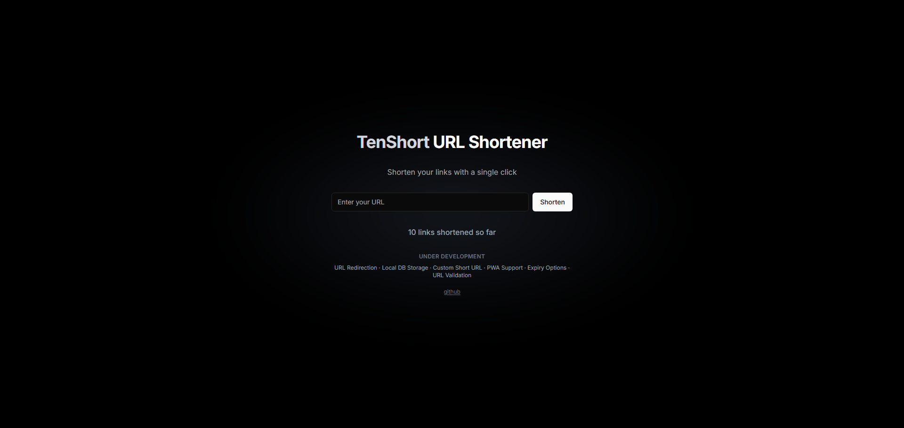

# TenShort URL Shortener  

  

A minimal **URL shortener** built with **Next.js** and **ShadCN UI**, created **specifically to test** [Vercel Fluid](https://vercel.com/fluid).  

## Features  
- Basic URL shortening  
- Minimal UI with ShadCN  
- Experimenting with **Vercel Fluid’s** new capabilities  

## Roadmap  

### Under Development  
- [ ] URL Redirection  
- [ ] Local DB Storage  
- [ ] Custom Short URL  
- [ ] PWA Support  
- [ ] Expiry Options  
- [ ] URL Validation  

## Deployment  
This project is **not production-ready**—it's purely for experimenting with **Vercel Fluid**.  
